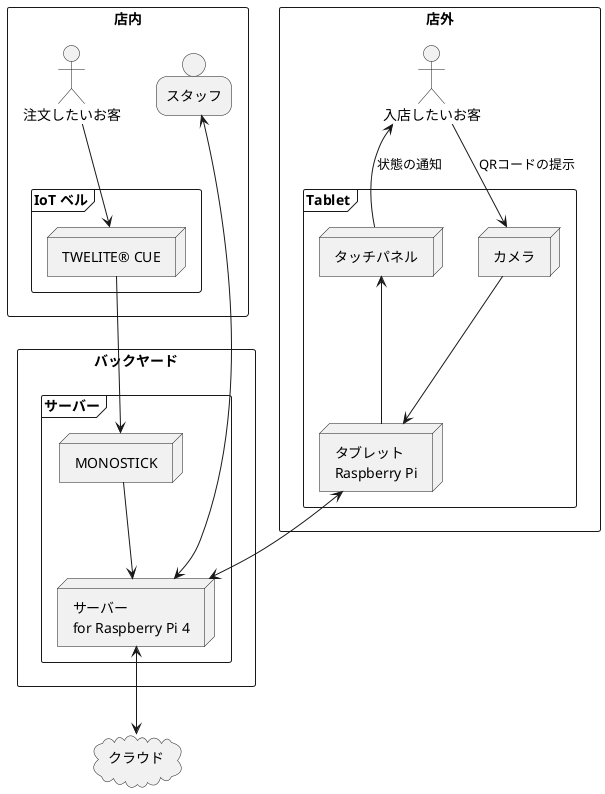

# IoT_BELL

カフェの入店管理するシステムです。

* 入店時に予約番号がわかるもの（QRコードなど）を提示してもらうことで、来店を検知する。
* 卓におかれたIoTベルを鳴らすことで、スタッフに呼び出しがあったことを通知する。

## 全体構成

## 利用しているハードウェア

| ハードウェア名       | 用途                                 | URL                                                          |
| -------------------- | ------------------------------------ | ------------------------------------------------------------ |
| Raspberry Pi 4       | 携帯サーバー 兼 タブレットの画面表示 | https://www.raspberrypi.com/products/raspberry-pi-4-model-b/ |
| TWELITE® CUE         | ベルのシェイク検知                   | https://mono-wireless.com/jp/products/twelite-cue/index.html |
| MONOSTICK            | TWELITE® CUEのシェイク検知を受信する | https://mono-wireless.com/jp/products/MoNoStick/index.html   |
| Raspberry Pi用カメラ | QRコード表示                         |                                                              |

## License

* QRコードは(株)デンソーウェーブの登録商標です

